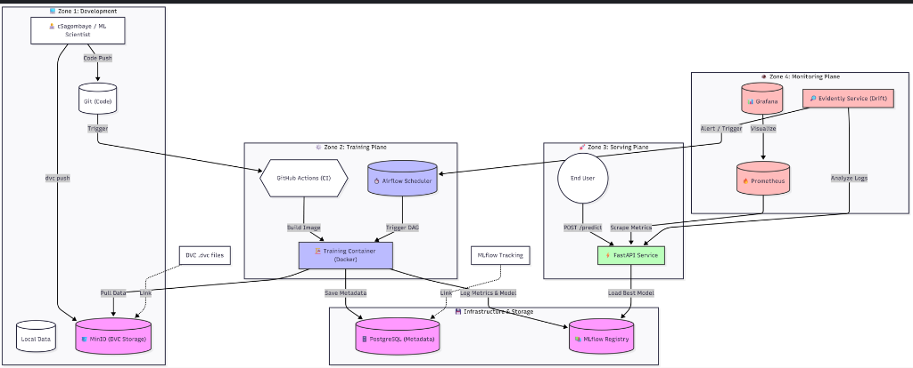

# House Pricing MLOps

Production-grade ML system for California housing price prediction with full MLOps capabilities.

## Overview

This project implements a complete MLOps pipeline including data versioning, model training, serving, monitoring, and automated retraining triggered by data drift detection.

## Architecture



## Components

| Component | Purpose | Port |
|-----------|---------|------|
| API | Model inference, health, metrics | 8000 |
| MLflow | Experiment tracking, model registry | 5000 |
| Airflow | Pipeline orchestration | 8081 |
| PostgreSQL | Metadata storage | 5432 |
| MinIO | Artifact storage (S3-compatible) | 9000/9001 |
| Prometheus | Metrics collection | 9090 |
| Grafana | Visualization | 3000 |

## Quick Start

### Prerequisites

- Docker and Docker Compose
- Python 3.12+
- Make

### Development Mode

```bash
# Clone repository
git clone https://github.com/CodeWithSagomb/house-pricing-mlops.git
cd house-pricing-mlops

# Copy environment template
cp .env.example .env

# Start all services
docker compose up -d

# Verify services
docker compose ps
```

### Production Mode (HTTPS)

```bash
# Generate self-signed certificates
./scripts/generate-certs.sh

# Start with Traefik reverse proxy
docker compose -f docker-compose.yml -f docker-compose.prod.yml up -d
```

## Service URLs

### Development

| Service | URL |
|---------|-----|
| API Docs | http://localhost:8000/docs |
| MLflow | http://localhost:5000 |
| Airflow | http://localhost:8081 |
| Grafana | http://localhost:3000 |
| MinIO Console | http://localhost:9001 |

### Production (HTTPS)

| Service | URL |
|---------|-----|
| API | https://api.localhost |
| MLflow | https://mlflow.localhost |
| Airflow | https://airflow.localhost |
| Grafana | https://grafana.localhost |

## Airflow Pipelines

### DataOps Pipeline

Data ingestion, validation, transformation, and DVC versioning.

```bash
docker exec mlops_airflow_scheduler airflow dags trigger dataops_pipeline
```

### Training Pipeline

Model training, evaluation, and MLflow registration.

```bash
docker exec mlops_airflow_scheduler airflow dags trigger training_pipeline
```

### Retraining Trigger

Monitors drift status hourly and triggers training when drift is detected.

```bash
# Runs automatically every hour
# Manual trigger:
docker exec mlops_airflow_scheduler airflow dags trigger retraining_trigger
```

## API Endpoints

### Prediction

```bash
curl -X POST http://localhost:8000/predict \
  -H "Content-Type: application/json" \
  -H "X-API-KEY: <your-api-key>" \
  -d '{
    "MedInc": 8.3,
    "HouseAge": 41,
    "AveRooms": 6.9,
    "AveBedrms": 1.0,
    "Population": 322,
    "AveOccup": 2.5,
    "Latitude": 37.88,
    "Longitude": -122.23
  }'
```

### Batch Prediction

```bash
curl -X POST http://localhost:8000/predict/batch \
  -H "Content-Type: application/json" \
  -H "X-API-KEY: <your-api-key>" \
  -d '{
    "predictions": [
      {"MedInc": 8.3, "HouseAge": 41, "AveRooms": 6.9, "AveBedrms": 1.0, "Population": 322, "AveOccup": 2.5, "Latitude": 37.88, "Longitude": -122.23},
      {"MedInc": 3.5, "HouseAge": 25, "AveRooms": 5.0, "AveBedrms": 1.1, "Population": 1500, "AveOccup": 3.0, "Latitude": 34.05, "Longitude": -118.25}
    ]
  }'
```

### Drift Status

```bash
curl http://localhost:8000/monitoring/drift-status
```

### Health Check

```bash
curl http://localhost:8000/health
```

## Monitoring

### Prometheus Metrics

Available at `/metrics`:

- `http_requests_total` - HTTP request count by endpoint
- `http_request_duration_seconds` - Request latency
- `drift_detected_total` - Drift detection events
- `drift_share` - Proportion of columns with drift

### Grafana Dashboards

- ML Model Performance
- Drift Monitoring
- API Metrics

## Project Structure

```
house-pricing-mlops/
├── src/house_pricing/
│   ├── api/                 # FastAPI application
│   ├── dataops/             # Data pipeline modules
│   ├── models/              # Training logic
│   └── monitoring/          # Drift detection
├── airflow/
│   └── dags/                # Pipeline definitions
├── traefik/                 # Reverse proxy config
├── monitoring/
│   ├── prometheus/          # Metrics config
│   └── grafana/             # Dashboards
├── scripts/                 # Utility scripts
├── tests/                   # Unit and integration tests
├── config/                  # YAML configurations
├── .github/workflows/       # CI/CD pipelines
├── docker-compose.yml       # Development setup
└── docker-compose.prod.yml  # Production overlay
```

## Configuration

Environment variables are documented in `.env.example`. Key variables:

| Variable | Description |
|----------|-------------|
| `API_KEY` | API authentication key |
| `POSTGRES_PASSWORD` | Database password |
| `MINIO_ROOT_PASSWORD` | Object storage password |
| `MLFLOW_TRACKING_URI` | MLflow server URL |

## Testing

```bash
# Run all tests
make test

# Run with coverage
pytest --cov=house_pricing tests/

# Integration tests only
pytest tests/integration/ -v
```

## CI/CD

GitHub Actions pipeline:

1. **Lint** - Code style (black, flake8, isort)
2. **Test** - Unit and integration tests
3. **Security** - Trivy vulnerability scan
4. **Build** - Docker image
5. **Deploy** - Push to registry

## License

MIT License
